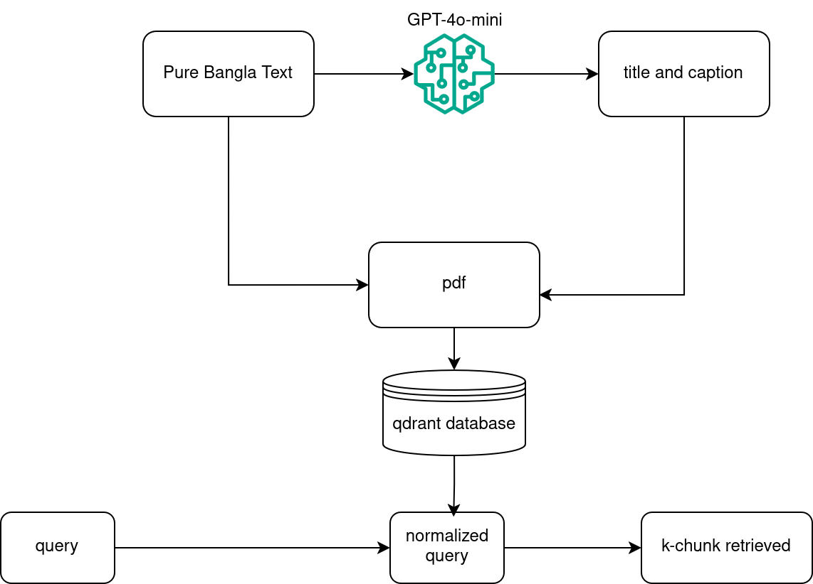
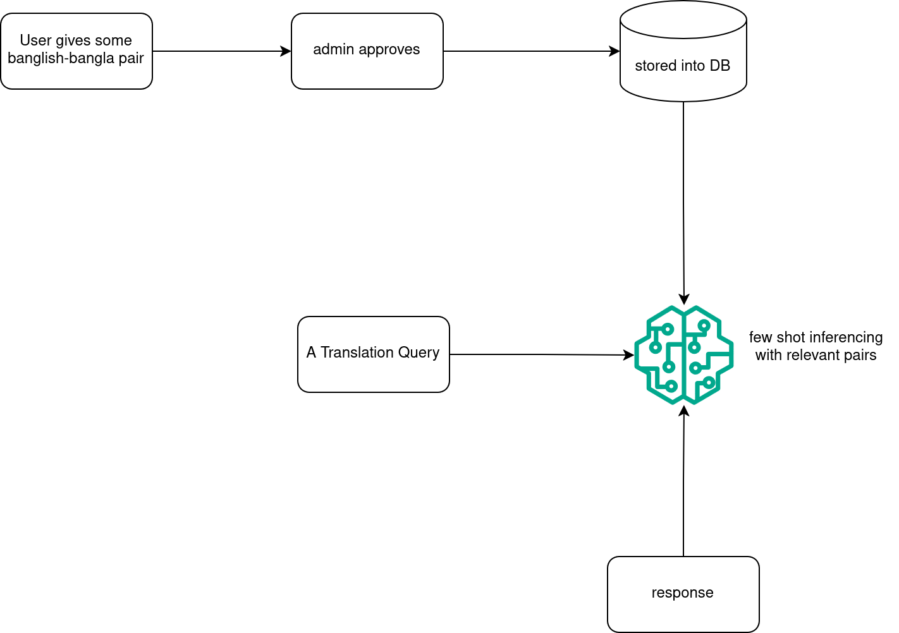
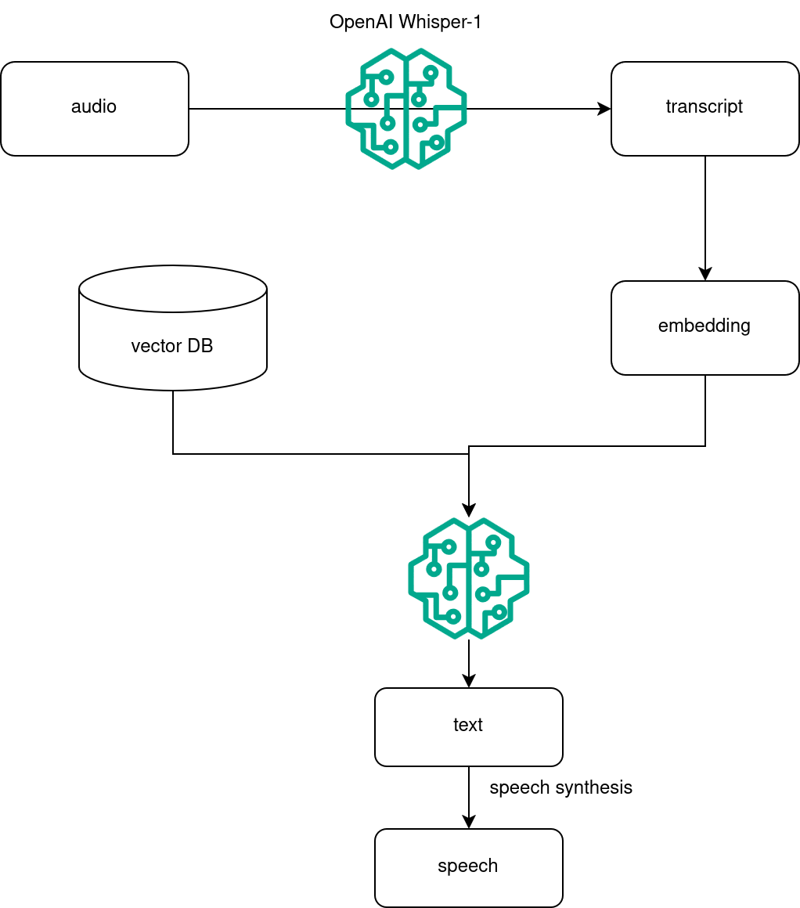

[visit here](https://buet-genesis.onrender.com/docs) For API Documentations

# Running the Frontend

follow the following commands. 

```bash
npm i
```

```bash
npm start
```


# Running the Backend
## FastAPI Backend
## Virtual environment
Make sure python3-venv is in your machine
```bash
sudo apt install python3-venv
```
Make a python virtual environment with the following command:
```bash
python3 -m venv .venv
```
activate the environment
```bash
source .venv/bin/activate
```

## Install dependencies
Install the required packages with the following command:
```bash
pip install -r requirements.txt
```
## Running the backend
To run the backend server, use the following command:

```bash
uvicorn app.main:app --reload
```

The app will start:

```bash
http://127.0.0.1:8000/
```

Once the application is running, you can access the API documentation provided by Swagger at:

```bash
http://127.0.0.1:8000/docs
```

Here, you can explore and interact with the various API endpoints.


## Make changes in the database
execute the following command
```bash
./push.sh
```

## Authentication
- using supabase for authentication purpose
- Every path other than login and signup requires bearer token
- the token refreshes after 1 hour

## Database
- using postgresql for database
- Hosted the database in supabase
- using sqlalchemy as ORM
- Using Database pooling. Using default pool size = 15

## Database Migration Tool
Using Alembic as DB-migration tool

## SMTP
- Using Gmail custom smtp (smtp.gmail.com) . Thus confirmation mail goes from our own gmail
- therefore can handle 1100 user mail authentication in 1 hour

# chat with knowledge-base
## Vector Database
we have used Qdrant for vector database

## Embedding model
we have used the text-embedding-3-large model for generating embedding

## Pdf Font
used [Noto-Sans font from Google fonts](https://fonts.google.com/noto/specimen/Noto+Sans+Bengali?query=bangla)

## File-ingestion Pipeline
- We receive the "pure bangla text" from the text editor
- we generate a suitable title and caption for the file
- we upload the pdf in supabase bucket and fetch the link of the file
- we generate some metadata for the parsed content
- we vectorize and store the chunks in qdrant

## RAG chat pipeline
- The default knowledge base if user's uploaded contents
- User can also customize a chat by adding some public files for that chat only
- User asks a query (in bangla/ banglish)
- With AI agent, we normalize the user query (for better context-ingestion and searching-ready for the vector database)
- we vectorize the standardized prompt and search in the vector database
- we fetch k-most relevant chunks
- then we feed the query and fetched chunks to AI-agent
- AI agent then generates Bengali response using our custom knowledge base



## Translation Generation:

### For translation, we have tried 2 ways:
#### Way-1:
- We have used Few-shot prompting that is used as a technique to enable in-context learning
- Our users contribute in geenrating learning samples ({banglish, bangla} pairs)
- admins approve some of them
- The approved pairs are used as few shot inferencing
- Future plan is to run a cron job (after 1 week) to collect the approved samples and use them to train model using openai's fine-tune api. Currently it could not be done due to costing reasons



#### way-2:
- used Google Transliterate API
- The transliteration is phonetic, meaning it maps input sounds in one script (e.g., Latin/English) to equivalent sounds in the target script (e.g., Bengali).
- This engine primarily relies on rule-based linguistic mappings and possibly some statistical or probabilistic enhancements for ambiguity resolution.
- we chose this option for better latency support

## Audio chat Pipeline
- we used OpenAI's whisper-1 model for generating transcript for user speech
- We generated embedding for transcripted text
- we searched vector database for relevant chunks
- we fed knowledge and query to AI-agent. It responded in text
- with browsers SpeechSynthesis api, we can convert the textual response to speech
- After returning the audio response, we did the db-storing activities using FastAPI's background task

## Latency Handling at the time of translating Banglish to bangla
- we have used FastAPI's Background task to execute db-operations in a separate thread. When the thread updates the db-operation, we terminate it
- we return the translation as soon as we get
  

## deployment
[deployed-site](https://buet-genesis.onrender.com)
- used renders docker template for fastapi for deployment
- how dealt with Render's freezing issue?
- there is a dummy GET endpoint in /, Ran a cronjon from [a cronjob site](https://cron-job.org/en/)

